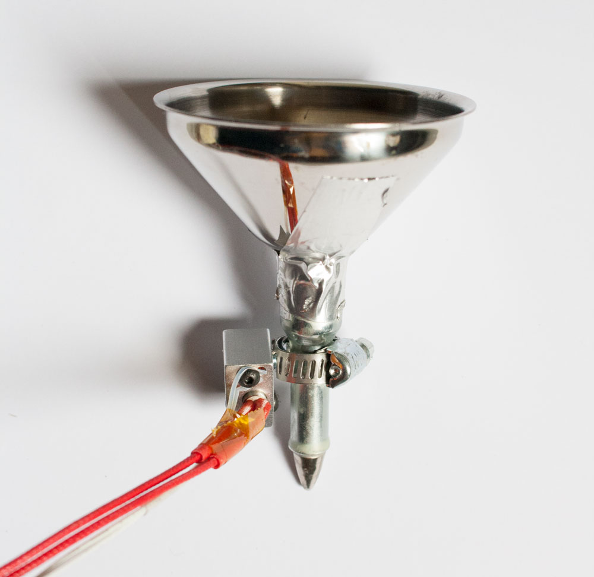
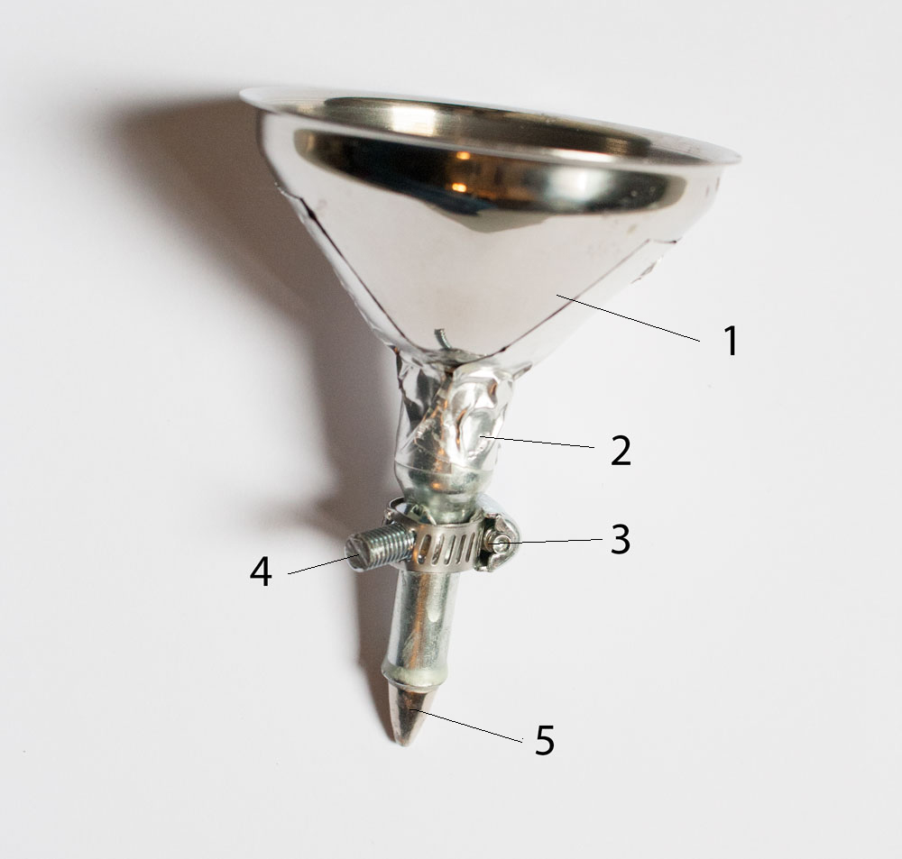
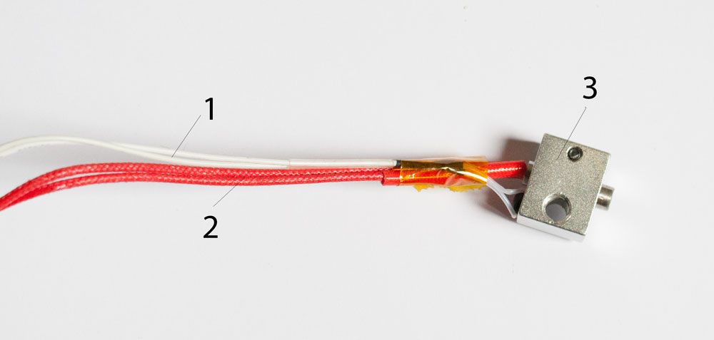
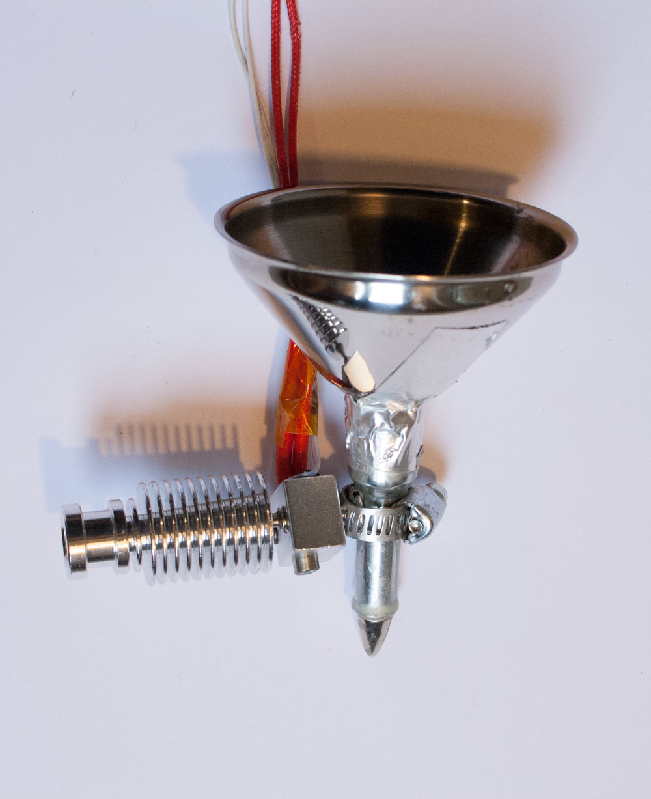

# How to build the Wax Printer Pen

Here you can find the intructions for how to build the latest version of the Pen of the Wax Printer. 
This design has been thought to be mounted on the Textile Drawing Machine.
Generally this pen is the combination of different elements cominng from an [Electric Tjanting Tool](https://www.dharmatrading.com/tools/electric-tjanting-tool-temperature-regulator.html), commonly used in batik hand print and a [HotEnd](http://reprap.org/wiki/Hot_End_Comparison) commonly used for 3d printers.
To understand how the drawing element works with wax please check this [video](https://www.youtube.com/watch?v=ODphk4oqr2A).

### Components list

1 - Metal funnel.  
2 - Heat resist tape.  
3 - [Hose Clamp.](https://en.wikipedia.org/wiki/Hose_clamp)   
4 - 1 screw with a flat head and Thread Diameter that will allow it to screw on the Aluminium Heater Block. See next img.  
5 - Drawing part of an [Electric Tjanting Tool.](https://www.dharmatrading.com/tools/electric-tjanting-tool-temperature-regulator.html)

As first thing i bought an Electric Tjanting tool and diassembled it. I later connected a metal funnel with the drawing part by inserting the funnel in the pen and fixing it with heat resist tape. The funnel needs to be made of metal becuase all this object will become hot to host the melted wax.
I than made a hole on the Hose Clamp in order to be able to insert a flat head scre and than i tight the Hose clamp arounf the drawing part. I need to do this to be able to connect the Aluminum Heater Block to the drawing part, therefore choose the flat head screw thread diameter according to the hole present on the Aluminium Heater Block.

1 - Thermistor Cartridge.   
2 - Heater Cartridge.   
3 - Aluminium Heater Block.  

These components come from a regular V6 All-Metal [HotEnd](http://reprap.org/wiki/Hot_End_Comparison). I decided to generate heat with the components of a HotEnd, becuase they are easilly sourceable and i can control the heat with the same board and software i use to control the motors of the drawing machine. (Ramps 1.4 and Macpronterface). 
For more information see How to Build the Machine instructions.

Screw the Aluminium Heater Block onto the drawing element.

I than used the Aluminium Heatsink, also part of a regular V6 All-Metal HotEnd to have a gripping element to connect the Pen to the Z Axes of the drawing machine. Also the Aluminium Heatsink is screwed onto the Aluminium Heater Block.

